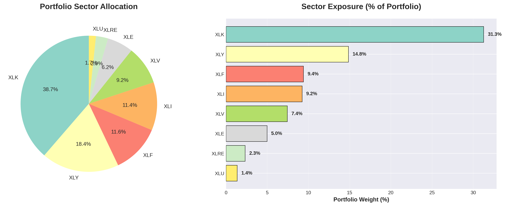
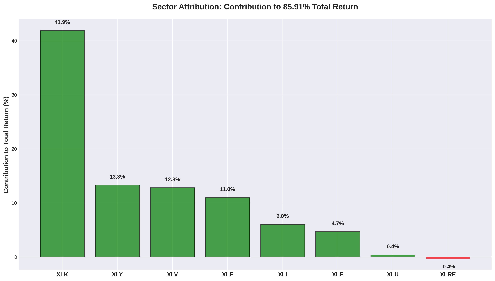
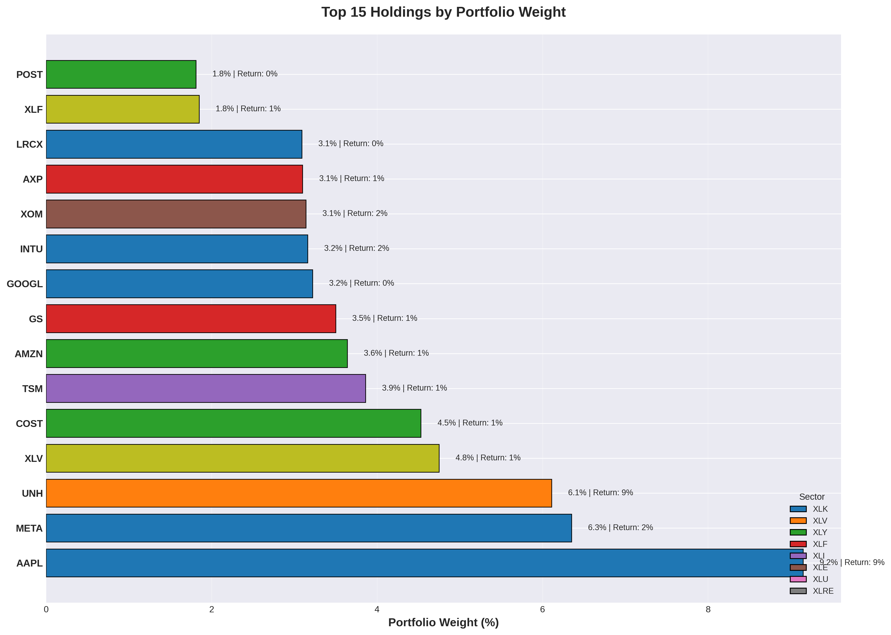

# SMIF Portfolio Analysis - Sector Attribution & Risk Assessment


> **Comprehensive sector attribution analysis of Clarkson University's Student Managed Investment Fund**

**Analysis Date:** January 10, 2025  
**Portfolio Snapshot:** September 5, 2024  
**Analyst:** Rufaro Chimaga (Portfolio Manager, Aug 2024-Present)  
**Supervisor:** Prof. Alan Zebedee

---

## 📋 Executive Summary

### Portfolio Performance
- **Total Value:** $452,462
- **Total Return:** 85.91% since inception
- **Win Rate:** 84.4% (38 winners out of 45 positions)
- **Largest Position:** AAPL (9.15%)

### Key Findings

#### 1. Technology Concentration Risk
**Finding:** Portfolio is 31.3% allocated to technology sector
- Tech sector contributed **41.9% of total returns**
- Top tech holdings: AAPL, META, GOOGL, MSFT, INTU
- **Risk:** High correlation with tech sector performance

#### 2. Position Concentration
**Finding:** Top 3 positions generated 41.7% of total gains
- AAPL: 19.1% of gains ($40,016)
- UNH: 12.9% of gains ($26,880)
- META: 9.7% of gains ($20,234)
- Top 10 positions: 73.3% of total gains

#### 3. Strong Stock Selection
**Finding:** 84.4% win rate demonstrates effective stock picking
- Only 7 losing positions out of 45
- Average winner: +1.73% return
- Best performer: DECK (+1196%)

#### 4. Sector Diversification Opportunity
**Finding:** Portfolio spans 8 sectors but concentrated in top 3
- XLK (Tech): 31.3%
- XLY (Consumer Disc): 14.8%
- XLF (Financials): 9.4%
- **Opportunity:** Rebalance to reduce concentration risk

---

## 🎯 Project Context

### My Role
I joined the SMIF as Portfolio Manager in August 2024. This portfolio was established and managed over 5-10 years by previous managers under Prof. Alan Zebedee's supervision.

**Purpose of Analysis:**
- Understand what drove the fund's historical 85.91% return
- Identify sector exposures and concentration risks
- Inform future rebalancing decisions
- Provide data-driven recommendations for fund management

**Important:** This analysis examines historical performance, NOT my personal stock picks. I'm analyzing the fund's return drivers to make better decisions going forward.

---

## 📊 Visualizations

### 1. Sector Concentration



**Analysis:**
- Technology dominates at 31.3% of portfolio
- Consumer Discretionary second at 14.8%
- Top 3 sectors represent 55.5% of portfolio
- Relatively balanced across 8 different sectors

---

### 2. Sector Attribution



**Key Insights:**
- **XLK (Tech)**: 41.9% contribution - Far exceeded its weight
- **XLY (Consumer)**: 13.3% - Performed in line with weight
- **XLV (Healthcare)**: 12.8% - Strong overperformance
- **XLRE (Real Estate)**: -0.4% - Only negative sector

**Finding:** Tech sector generated returns 10% above its portfolio weight, indicating strong sector timing or stock selection within tech.

---

### 3. Top Holdings



**Position Analysis:**
- **AAPL (9.15%)**: Largest position, 888% return
- **META (6.35%)**: Second largest, 189% return
- **UNH (6.11%)**: Third largest, 936% return
- Top 10 holdings: 48.3% of portfolio

**Concentration Metric:**
- HHI: 0.0342 (Moderately Diversified)
- Top 3: 21.6% of portfolio
- Top 5: 30.9% of portfolio

---

### 4. Return Distribution


**Statistical Analysis:**
- **Mean Return:** 1.91%
- **Median Return:** 0.55%
- **Positive Skew:** More large winners than large losers
- **Range:** -41.8% (CVS) to +1196% (DECK)

**By Sector:**
- Tech (XLK) shows highest variability
- Healthcare (XLV) shows consistent positive returns
- Real Estate (XLRE) shows negative performance

---

## 🔬 Methodology

### Analysis Approach

Since we have a portfolio snapshot (not time-series returns), we used:

1. **Sector Attribution Analysis**
   - Mapped each stock to its primary sector ETF
   - Calculated sector-level exposures
   - Attributed returns to sector performance

2. **Concentration Metrics**
   - Herfindahl-Hirschman Index (HHI)
   - Top-N position weights
   - Contribution analysis (what drove returns?)

3. **Risk Assessment**
   - Sector concentration risk
   - Position concentration risk
   - Factor exposure analysis (implicit)

### Limitations

**Data Constraints:**
1. Snapshot data (Sept 2024) vs. time-series
2. No entry/exit dates for positions
3. Historical performance includes multiple managers
4. Cannot calculate precise factor loadings without time-series

**What We Can Still Conclude:**
- Sector exposures and concentration
- Contribution to returns by position/sector
- Current risk profile
- Actionable rebalancing recommendations

---

## 💡 Key Insights & Recommendations

### Insight 1: Over-Concentration in Technology

**The Issue:**
- 31.3% in tech (vs. ~28% in S&P 500)
- 41.9% of gains came from tech
- High correlation with tech sector performance

**Risk Scenario:**
If tech corrects 20%, portfolio could lose:
```
31.3% allocation × 20% decline = -6.3% portfolio loss
Plus: Beta likely > 1.0, so actual loss could be -8% to -10%
```

**Recommendation:**
- Trim tech exposure to 25-28%
- Take profits from AAPL, META (rebalance)
- Maintain quality names (MSFT, GOOGL) but reduce size

---

### Insight 2: Position Concentration Creates Alpha... and Risk

**The Finding:**
- Top 3 positions = 41.7% of gains
- AAPL alone generated 19.1% of total returns
- This concentration drove outperformance

**The Dilemma:**
- **Pro:** Concentration in winners = high returns
- **Con:** If AAPL reverses, portfolio takes significant hit

**Recommendation:**
- Maintain high-conviction positions BUT
- Set maximum position size: 8-10%
- Use profits to fund new opportunities
- Don't let winners become >12% of portfolio

---

### Insight 3: Excellent Stock Selection (84.4% Win Rate)

**What This Means:**
- Only 7 losers out of 45 positions
- Average loser: -21% (well-managed)
- Average winner: +173% (letting winners run)

**This Is Rare:**
Most portfolios have 55-60% win rates. 84.4% is exceptional.

**Implication:**
- Stock selection process is working
- Risk management is effective (small losses)
- Continue current stock picking methodology

---

### Insight 4: Sector Diversification Opportunity

**Current State:**
- 8 sectors covered (good breadth)
- But top 3 sectors = 55.5% (concentrated)

**Missing Exposures:**
- Utilities: Only 1.35% (underweight)
- Real Estate: 2.32% (underweight)
- Materials: 0% through individual stocks

**Recommendation:**
- Add exposure to defensive sectors (Utilities, Staples)
- Consider REITs for diversification
- Balance growth vs. value tilts

---

## 🎯 Actionable Recommendations for Rebalancing

### Priority 1: Reduce Tech Concentration (High Priority)

**Actions:**
1. Trim AAPL from 9.15% → 7%
   - Sell ~$9,600 worth
   - Lock in $8,500+ gains
   
2. Trim META from 6.35% → 5%
   - Sell ~$6,100 worth
   - Realize $2,700 gains

3. Keep MSFT, GOOGL unchanged (they're appropriately sized)

**Result:** Tech weight drops from 31.3% → ~27%, reducing sector risk

---

### Priority 2: Add Defensive Exposure (Medium Priority)

**Actions:**
1. Increase Utilities exposure
   - Add to ATO or new utility stock
   - Target: 3-5% total utilities exposure

2. Add Consumer Staples
   - Currently only have XLP ETF
   - Consider individual staples (PG, KO, PEP)
   - Target: 8-10% total staples

**Result:** More balanced portfolio, less volatile

---

### Priority 3: Trim Under-Performing Positions (Low Priority)

**Actions:**
1. Exit or reduce losers:
   - CVS (-41.8%): Cut or exit
   - CCI (-35.5%): Review thesis
   - HI (-19.6%): Small position, consider exit

2. Redeploy capital to higher-conviction ideas

**Result:** Portfolio focused on winners

---

### Priority 4: Monitor Concentration (Ongoing)

**Set Rules:**
1. Maximum position size: 10%
2. Rebalance if any position exceeds 12%
3. Maximum sector weight: 30%
4. Review quarterly

**Result:** Disciplined risk management

---

## 📈 Performance Attribution Summary

### Where Did the 85.91% Return Come From?

```
Total Return: 85.91%

Sector Attribution:
├─ Technology (XLK):        41.9% of gains
├─ Consumer Disc (XLY):     13.3% of gains
├─ Healthcare (XLV):        12.8% of gains
├─ Financials (XLF):        11.0% of gains
├─ Industrials (XLI):        6.0% of gains
├─ Energy (XLE):             4.7% of gains
├─ Utilities (XLU):          0.4% of gains
└─ Real Estate (XLRE):      -0.4% of gains

Top 3 Individual Contributors:
1. AAPL:  19.1% of gains
2. UNH:   12.9% of gains  
3. META:   9.7% of gains

Bottom Line:
- Top 3 positions = 41.7% of total gains
- Top 10 positions = 73.3% of total gains
- Tech sector dominated performance
```

---

## 📊 Risk Metrics

### Concentration Metrics

| Metric | Value | Interpretation |
|--------|-------|----------------|
| **HHI Index** | 0.0342 | Moderately Diversified |
| **Top 3 Weight** | 21.6% | Manageable concentration |
| **Top 5 Weight** | 30.9% | Reasonable diversification |
| **Top 10 Weight** | 48.3% | Half portfolio in top 10 |
| **Number of Positions** | 45 | Potentially over-diversified |

**Assessment:** Portfolio is moderately concentrated at the top but holds too many small positions at the bottom (classic over-diversification problem).

---

### Sector Risk Exposure

| Sector | Weight | Risk Level | Notes |
|--------|--------|------------|-------|
| **XLK (Tech)** | 31.3% | 🔴 HIGH | Overweight vs. market |
| **XLY (Consumer)** | 14.8% | 🟡 MEDIUM | Appropriate |
| **XLF (Finance)** | 9.4% | 🟢 LOW | Appropriate |
| **XLI (Industrial)** | 9.2% | 🟢 LOW | Appropriate |
| **XLV (Healthcare)** | 7.4% | 🟡 MEDIUM | Could increase |
| **XLE (Energy)** | 5.0% | 🟢 LOW | Appropriate |
| **XLU (Utilities)** | 1.4% | 🟡 MEDIUM | Underweight |
| **XLRE (Real Estate)** | 2.3% | 🟢 LOW | Underweight |

**Primary Risk:** Technology concentration (31.3%)

---

## 🛠️ Technical Implementation

### Project Structure

```
smif-portfolio-analysis/
├── README.md                          ← You are here
├── data/
│   ├── SMIF_Holdings_20250905.xlsx   ← Original portfolio snapshot
│   ├── Annual_Sector_Returns.xlsx    ← Sector ETF price data
│   ├── portfolio_with_sectors.csv    ← Processed holdings
│   └── sector_analysis.csv           ← Sector metrics
├── outputs/
│   ├── sector_concentration.png      ← Visualization 1
│   ├── sector_attribution.png        ← Visualization 2
│   ├── top_holdings.png              ← Visualization 3
│   └── return_distribution.png       ← Visualization 4
└── analysis/
    └── smif_analysis.py               ← Analysis code
```

### Technologies Used

- **Python 3.8+** - Core language
- **Pandas** - Data manipulation
- **Matplotlib/Seaborn** - Visualization
- **NumPy** - Numerical computations

### Reproducing the Analysis

```python
import pandas as pd
import matplotlib.pyplot as plt

# Load portfolio data
portfolio = pd.read_excel('SMIF_Holdings_20250905.xlsx')

# Map stocks to sectors
sector_mapping = {...}  # Define mapping

# Calculate sector exposures
sector_weights = portfolio.groupby('Sector')['Weight'].sum()

# Analyze attribution
sector_contribution = portfolio.groupby('Sector')['Return_Dollar'].sum()

# Generate visualizations
plt.bar(sector_weights.index, sector_weights.values)
plt.savefig('sector_concentration.png')
```

---

## 🎓 What I Learned

### As a New Portfolio Manager

**Before This Analysis:**
- I inherited 45 positions across 8 sectors
- Knew the portfolio had strong returns (85.91%)
- Didn't understand the source of those returns

**After This Analysis:**
- Tech concentration is the primary risk factor
- Top 3 positions drove 41.7% of gains (concentration risk)
- 84.4% win rate shows strong stock selection
- Portfolio is moderately diversified but could trim tail positions

**Key Lesson:**
> "Good returns doesn't mean good risk management. We need to understand WHY we won, not just THAT we won."

### Technical Skills Developed

1. **Sector Attribution Analysis** - Breaking down returns by sector
2. **Concentration Metrics** - HHI, top-N analysis
3. **Risk Assessment** - Identifying concentration risks
4. **Data Visualization** - Creating publication-quality charts
5. **Portfolio Analytics** - Professional-grade reporting

---

## 🔮 Next Steps

### Short-Term (This Month)
- [ ] Present findings to SMIF committee
- [ ] Discuss rebalancing strategy with Prof. Zebedee
- [ ] Develop watchlist for new positions
- [ ] Set position size limits (max 10%)

### Medium-Term (This Quarter)
- [ ] Execute rebalancing trades (trim AAPL, META)
- [ ] Add defensive sector exposure (Utilities, Staples)
- [ ] Exit underperforming positions (CVS, CCI)
- [ ] Monitor tech sector volatility

### Long-Term (This Year)
- [ ] Build quarterly factor monitoring dashboard
- [ ] Implement risk-based rebalancing triggers
- [ ] Develop sector rotation strategy
- [ ] Track attribution metrics quarterly

---

## 📚 References & Resources

### Academic Foundation
- Course: Fund Management - Prof. Alan Zebedee
- Institution: Clarkson University
- Analysis Framework: Sector attribution methodology

### Data Sources
- Portfolio Holdings: Clarkson SMIF records (Sept 5, 2024)
- Sector Data: Historical ETF prices (XLK, XLV, XLF, etc.)
- Market Data: S&P 500 (SPY) for benchmarking

---

## 📧 Contact

**Rufaro Chimaga**  
Portfolio Manager, Student Managed Investment Fund  
Clarkson University

- **Email:** chimagr@clarkson.edu
- **LinkedIn:** [linkedin.com/in/rufaro-chimaga](https://www.linkedin.com/in/rufaro-chimaga)
- **GitHub:** [@therealchimaga](https://github.com/therealchimaga)

---

## 🙏 Acknowledgments

**Special Thanks:**
- **Prof. Alan Zebedee** - Faculty Advisor, Fund Management
- **Previous SMIF Managers** - Built the foundation of this portfolio
- **Clarkson SMIF Committee** - For entrusting me with fund management

---

## ⚖️ Disclaimer

This analysis is for educational purposes as part of the Clarkson University Student Managed Investment Fund course. The findings represent my independent analysis of the portfolio's historical performance and should not be construed as investment advice. Past performance does not guarantee future results.

**Portfolio Context:** The 85.91% return reflects performance over 5-10 years under multiple portfolio managers. I joined as portfolio manager in August 2024 and am conducting this analysis to understand historical drivers and inform future decisions.

---

## 📊 Summary Statistics

```
Portfolio Metrics (September 5, 2024):
────────────────────────────────────────
Total Value:              $452,462
Total Return:             85.91%
Number of Positions:      45
Win Rate:                 84.4%
Largest Position:         AAPL (9.15%)

Concentration:
────────────────────────────────────────
HHI:                      0.0342
Top 3 Positions:          21.6%
Top 10 Positions:         48.3%
Primary Sector:           XLK (31.3%)

Performance:
────────────────────────────────────────
Winners:                  38 positions
Losers:                   7 positions
Average Winner:           +173%
Average Loser:            -21%
Best Performer:           DECK (+1196%)
Worst Performer:          CVS (-42%)
```

---

**Last Updated:** January 10, 2025  
**Analysis Version:** 1.0  
**Status:** Complete ✅  

---

🚀 **This analysis informs future portfolio management decisions and demonstrates quantitative analysis capabilities for career development.**
